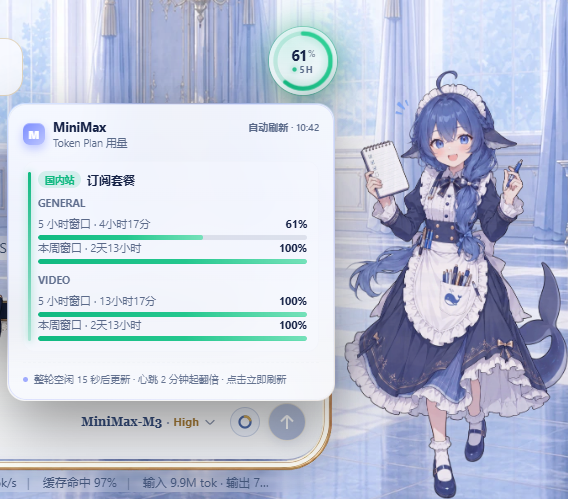

# dsh-minimax-usage

在 DeepSeek Harness (DSH) Web UI 中显示 MiniMax Token Plan 订阅用量。

插件读取官方 [Token Plan 用量接口](https://platform.minimax.io/docs/token-plan/faq)
`GET /v1/token_plan/remains`，在对话框模型选择器旁显示紧凑的 5h / 7d 用量条。
密钥复用 DSH **设置 → 模型** 里已配置的订阅 Key，浏览器拿不到明文。



## 安装

### 推荐：从 npm 安装

```bash
npx @deepseek-ai/dsh plugin --profile web add dsh-minimax-usage
```

> ⚠️ **别用** `npx dsh plugin`——npm 上 `dsh` 这个名字早在 2016 年就被一个不相关的 JS shell 包占了（`dsh@1.0.1`，作者 `infusion`），它没暴露 CLI bin，会报 `could not determine executable to run`。DSH 的 CLI 在 scoped 包 `@deepseek-ai/dsh` 下，必须用完整名。

`web` 换成你的 profile 名。装完 **重启 DSH**。

### 备选：从 GitHub 装

锁定版本：

```bash
npx @deepseek-ai/dsh plugin --profile web add github:pan17/dsh-minimax-usage#v0.1.2
```

或默认分支最新：

```bash
npx @deepseek-ai/dsh plugin --profile web add github:pan17/dsh-minimax-usage
```

### 构建脚本授权

如果 pnpm 提示不允许跑构建脚本（`ERR_PNPM_GIT_DEP_PREPARE_NOT_ALLOWED`），在该 profile 的 `pnpm-workspace.yaml` 加上再重跑同一条命令：

```yaml
allowBuilds:
  dsh-minimax-usage: true
```

然后：

1. 打开 Web UI（默认 `http://127.0.0.1:3080`）
2. **设置 → 模型** 填写 Token Plan **订阅 Key**（不是普通按量付费 API Key）
3. 在对话框中选择 MiniMax Token Plan 模型后，模型选择器左侧会出现用量条；悬停看详情，点击用量条刷新

## 功能

- **内联用量条**：显示在对话框模型选择器左侧，按截图样式显示 5h / 7d 两条剩余进度
- **按 provider 显示**：只有当前选择 `minimax-cn` 或 `minimax` Token Plan provider 时显示；其他 provider 即使模型名含 MiniMax 也隐藏
- **悬停详情**：鼠标悬停或键盘聚焦可查看国内站 / 国际站、套餐名、窗口进度和重置倒计时
- **点击刷新**：点一下用量条强制刷新，不改变模型选择或发送操作
- **密钥来源**：`MINIMAX_API_KEY`（国际）与 `MINIMAX_CN_API_KEY`（国内），优先 `ctx.credentials`，其次进程环境变量
- **自动刷新**：只有实际运行中的 Agent 使用 `minimax` / `minimax-cn` Token Plan provider 时，才会每 30 秒强制拉取官方用量；切换到其他 provider 或 Agent 回到空闲后停止这条循环。整轮 Agent 回到空闲且这轮用过 MiniMax 后，再等 15 秒执行一次空闲刷新；之后心跳从 2 分钟起每次翻倍，上限 24 小时，再用 MiniMax 并空闲后心跳重置回 2 分钟。每轮快照还会按 5 小时窗口的重置时刻 + 30 秒再触发一次"重置后刷新"，第一时间拉取翻页后的额度。用量条每 15 秒只读 Host 缓存。点击立即强制刷新。

## 接口

| 区域 | 凭据 | 用量 URL |
|---|---|---|
| 国际 | `MINIMAX_API_KEY` | `www.minimax.io`，失败则回退 `api.minimax.io` |
| 国内 | `MINIMAX_CN_API_KEY` | `api.minimaxi.com`，失败则回退 `www.minimaxi.com` |

只查询已配置的区域。两把 Key 都有时，悬停详情中会并排展示两张账号卡。

## 注意

- 订阅 Key 与普通开放平台 API Key **不能混用**。用量接口拒绝普通 Key 时，页面会提示改用订阅 Key。
- 插件原样展示官方剩余额度，不本地「修正」扣费；`remains_time` 的语义以 MiniMax 控制台为准。
- `*_quota = 0` 的模型会标成「未包含」，而不是 0%。

## 发布

参见 [PUBLISH.md](./PUBLISH.md)：tag push 触发 GitHub Actions，自动 pack → GitHub Release → 等 CI 绿 → publish 到 npm。

## 开发

```bash
npm install
npm test
npm run build
```

本地未推送时也可以按路径装：

```bash
npx @deepseek-ai/dsh plugin --profile web add /path/to/dsh-minimax-usage
```